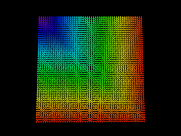
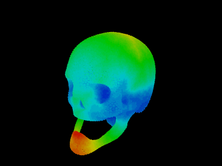
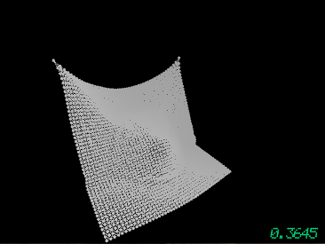

## Graph
Implementation of an undirected graph consisting of nodes and edges. Example applications built on top of the graph include visualizing shortest paths and simulating physics on simple objects.

- graph.hpp
	- Contains implementation of the graph, represented as an adjacency list.

- visualizer.cpp
	- Visualize a graph, where nodes are represented as 3D points, and edges are line segments connecting nodes.

- shortest_path.cpp
	- Finds shortest paths from a root node to all other nodes using Breadth-First Search. Visualizes path lengths as a heat map on the graph.

- mass_spring.cpp
	- Physics simulation where objects are represented by graphs. Nodes possess finite mass, and edges act as springs. Included constraints can simulate the object hitting, for example, a floor, or a spherical object.

## Running the Code
Requirements:
- Thrust and OpenMP

Example of visualizing a graph:

`make viewer`
`./viewer data/skull.nodes data/skull.tets`

Example running shortest_paths:

`make shortest_path`
`./shortest_path data/skull.nodes data/skull.tets`

 

Example running mass_spring simulation:
`make mass_spring`
`./mass_spring data/cloth.nodes data/cloth.tets`

## Acknowledgments
Credit for the utils helper files goes to the staff of the advanced software dev class at Stanford. The graph, shortest path, and mass spring simulation implementations are my own.
